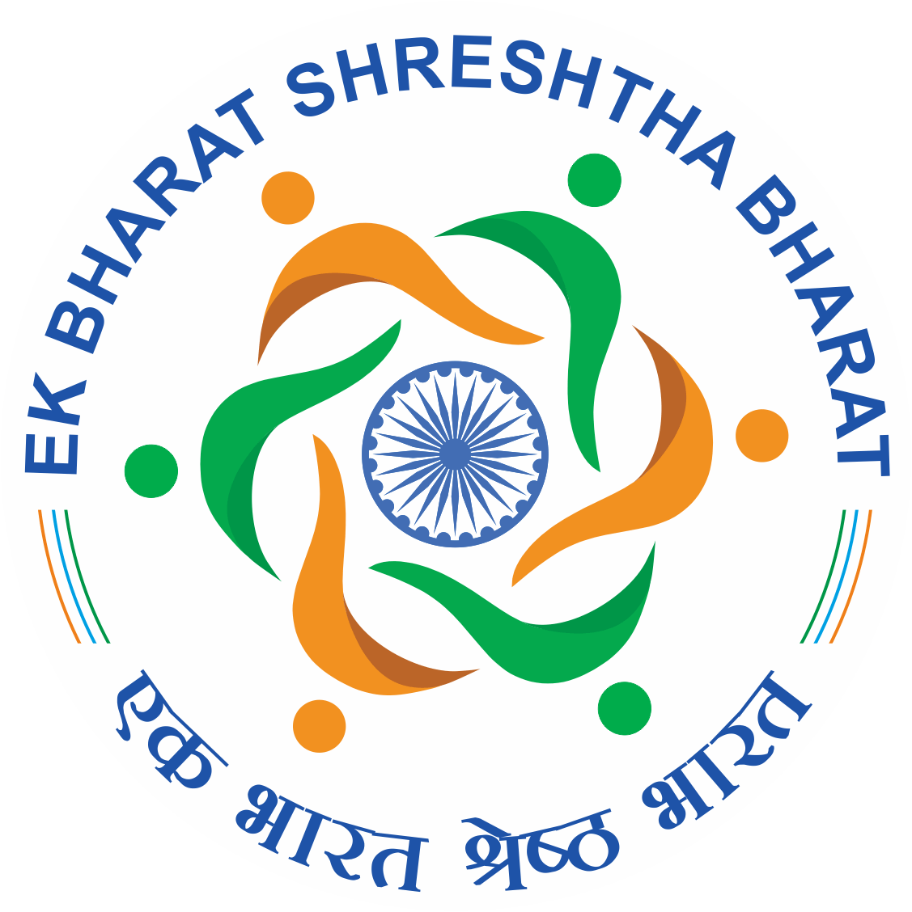

# 🇮🇳 Ek Bharat Shreshtha Bharat (EBSB) - IIT Jammu

<div align="center">



**Celebrating Unity in Diversity | Bridging Cultures Across India**

[](https://nextjs.org/)
[](https://www.typescriptlang.org/)
[](https://tailwindcss.com/)
[](LICENSE)

[🌐 Live Demo](https://ebsb-iitjmu.vercel.app) | [📧 Contact](mailto:ebsb@iitjammu.ac.in) | [🎯 About EBSB](https://ekbharat.gov.in/)

</div>

---

## 🎨 Project Overview

The **Ek Bharat Shreshtha Bharat (EBSB)** initiative at IIT Jammu is a comprehensive digital platform that celebrates India's rich cultural diversity while fostering national integration. This modern web application serves as the central hub for cultural exchange programs, events, and activities that connect students from different states and union territories.

### 🌟 Vision Statement

_"To celebrate the idea of India as a nation wherein different cultural units across varied geographies coalesce and interact with each other through diverse languages, cuisine, music, dance, theatre, handicrafts, sports, literature, festivals, and arts."_

## 🎯 Core Objectives

Our platform is built around five fundamental missions:

| Mission          | Description                                                                  |
| ---------------- | ---------------------------------------------------------------------------- |
| **🤝 PROMOTE**   | The spirit of national integration through deep and structured engagement    |
| **🎭 SHOWCASE**  | Rich heritage, culture, customs and traditions of India's diversity          |
| **🔗 ESTABLISH** | Long-term engagements that foster continuous cultural exchange               |
| **📚 CREATE**    | Learning environments through sharing best practices and experiences         |
| **🌉 BRIDGE**    | Cultural gaps by easing the feeling of being a stranger in different regions |

## 🌍 State Pairing Program

### 🤝 Jammu & Kashmir ↔ Tamil Nadu

As part of the national EBSB initiative, our institute facilitates cultural exchange between:

- **Northern Heritage**: Kashmiri culture, handicrafts, and traditions
- **Southern Heritage**: Dravidian culture, Tamil literature, classical dance forms

## 🛠️ Technology Stack

### Frontend Architecture

- **Framework**: Next.js 14 (App Router)
- **Language**: TypeScript (97.5%)
- **Styling**: Tailwind CSS (2.3%)
- **Fonts**: Geist Font Family
- **Images**: Next.js Image Optimization
- **Deployment**: Vercel Platform

### Key Features

- 📱 **Responsive Design**: Mobile-first approach with beautiful UI/UX
- ⚡ **Performance Optimized**: Fast loading with Next.js optimizations
- 🎨 **Modern UI**: Clean, cultural-themed design with Indian color palette
- 📊 **Dynamic Content**: Real-time updates for events and activities
- 🔍 **SEO Optimized**: Enhanced discoverability and accessibility

## 🎪 Platform Features

### 🎉 Cultural Activities

- **Cultural Exchange Programs** - Interstate student exchanges
- **Language Learning Workshops** - Multi-linguistic skill development
- **Food Festivals** - Celebrating diverse Indian cuisines
- **Literary Events** - Poetry, storytelling, and cultural narratives
- **Folk Dance Performances** - Traditional dance showcases
- **Music Competitions** - Classical and folk music events
- **Art & Handicraft Exhibitions** - Traditional crafts displays
- **Film Festivals** - Regional cinema appreciation
- **Educational Tours** - Heritage site visits
- **Traditional Attire Shows** - Cultural dress exhibitions

### 👥 Team Structure

Our dedicated team manages various aspects of the initiative:

- **Event Management** - Planning and execution
- **Media & Design** - Creative content and visual identity
- **Sponsorship & Outreach** - Partnership building
- **Operations & Support** - Resource management

## 🚀 Quick Start

### Prerequisites

- Node.js 18+
- npm/yarn/pnpm/bun package manager

### Installation

```bash
# Clone the repository
git clone https://github.com/ks-iitjmu/ebsb.git

# Navigate to project directory
cd ebsb

# Install dependencies
npm install
# or
yarn install
# or
pnpm install
```

### Development Server

```bash
# Start development server
npm run dev
# or
yarn dev
# or
pnpm dev
# or
bun dev
```

Open [http://localhost:3000](http://localhost:3000) to view the application.

### Build for Production

```bash
# Create production build
npm run build

# Start production server
npm start
```

## 📁 Project Structure

```
ebsb/
├── public/                  # Static assets (images, fonts, etc.)
│   ├── team/                # Team member photos/images
│   ├── image.png            # EBSB logo
│   ├── flowers.svg          # Decorative SVG assets
│   └── ...                  # Other public files (logos, banners)
├── src/
│   ├── app/                 # Next.js app directory (App Router)
│   │   ├── about/           # About page
│   │   │   └── page.tsx     # About page component
│   │   ├── team/            # Team page
│   │   │   └── page.tsx     # Team page component
│   │   ├── yuva-sangam/     # Yuva Sangam initiative page
│   │   │   └── page.tsx     # Yuva Sangam page component
│   │   ├── page.tsx         # Homepage component
│   │   └── layout.tsx       # App-wide layout component
│   ├── components/          # Reusable React components
│   │   ├── footer.tsx       # Footer component
│   │   ├── header.tsx       # (If present) Header/navbar component
│   │   └── ...              # Other UI components
│   ├── styles/              # Global and component styles (if not using Tailwind for all)
│   │   └── globals.css      # Global CSS (if used)
│   └── ...                  # Other source folders (hooks, utils, etc.)
├── .gitignore               # Git ignored files
├── package.json             # Project dependencies and scripts
├── tailwind.config.js       # Tailwind CSS configuration
├── tsconfig.json            # TypeScript configuration
├── README.md                # Project documentation
└── ...                      # Other configuration files (next.config.js, etc.)
```

## 🎯 Key Pages & Features

### 🏠 Homepage (`/`)

- Hero section with cultural imagery
- Featured events and activities
- Quick navigation to key sections
- Cultural objectives overview

### ℹ️ About Page (`/about`)

- EBSB mission and vision
- Detailed objectives breakdown
- State pairing information
- Cultural activities showcase

### 👥 Team Page (`/team`)

- Team coordinator information
- Department-wise team structure
- Individual member profiles
- Role-specific responsibilities

### 🚀 Yuva Sangam (`/yuva-sangam`)

- Youth engagement initiatives
- Leadership development programs
- Inter-state collaboration projects
- Student ambassador programs

## 🌟 Cultural Impact

### 📊 Achievements

- **Cultural Integration**: Bringing together diverse student communities
- **Educational Excellence**: Combining academic rigor with cultural awareness
- **National Unity**: Fostering understanding across different regions
- **Youth Leadership**: Developing culturally aware future leaders

### 🎭 Event Categories

- **Festivals**: Regional celebrations throughout the year
- **Workshops**: Skill-building in traditional arts
- **Competitions**: Inter-state cultural contests
- **Exhibitions**: Showcasing regional heritage
- **Tours**: Educational visits to cultural sites

## 📞 Contact Information

### 🏛️ Institution

**Indian Institute of Technology Jammu**

- 📍 **Address**: Nagrota Bypass, PO Nagrota, Jammu, J&K - 181221
- 📧 **Email**: [ebsb@iitjammu.ac.in](mailto:ebsb@iitjammu.ac.in)
- 📱 **Phone**: [+91 9419226775](tel:+919419226775)
- 🌐 **Website**: [iitjammu.ac.in](https://iitjammu.ac.in/)

### 🔗 Important Links

- [EBSB Official Portal](https://ekbharat.gov.in/)
- [IIT Jammu Main Website](https://iitjammu.ac.in/)
- [Ministry of Education](https://www.education.gov.in/)

## 🤝 Contributing

We welcome contributions from the community! Here's how you can help:

1. **Fork** the repository
2. **Create** a feature branch (`git checkout -b feature/amazing-feature`)
3. **Commit** your changes (`git commit -m 'Add amazing feature'`)
4. **Push** to the branch (`git push origin feature/amazing-feature`)
5. **Open** a Pull Request

### 📋 Contribution Guidelines

- Follow TypeScript best practices
- Maintain responsive design principles
- Ensure cultural sensitivity in content
- Test thoroughly before submitting

## 📜 License

This project is licensed under the MIT License - see the [LICENSE](LICENSE) file for details.

## 🙏 Acknowledgments

- **Ministry of Education, Government of India** for the EBSB initiative
- **IIT Jammu Administration** for institutional support
- **Students and Faculty** for active participation
- **Cultural Ambassadors** from partner states
- **Open Source Community** for technical resources

---

<div align="center">

**🇮🇳 Ek Bharat Shreshtha Bharat - Where Unity Meets Diversity 🇮🇳**

_Building bridges across cultures, one connection at a time._

**Made with ❤️ by kunalsharma**

---

_Last Updated: August 14, 2025_

</div>
